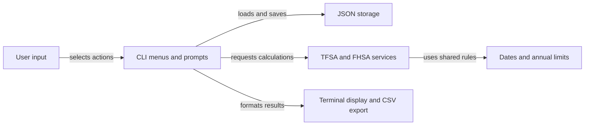

# Architecture

CRA CLI separates the interactive terminal interface from room calculations and local JSON persistence.

## Overview

The diagram shows how a menu action moves through the application.



## Components

### CLI

`src/cli/` contains Inquirer prompts, menu actions, and terminal output. It coordinates the services and storage but does not define annual limits.

### Services

`src/services/` calculates TFSA and FHSA room, projections, and CSV output. Room calculations take the profile and transactions as input and return results.

### Storage

`src/storage/storage.ts` reads and writes the local JSON profile. It also creates the initial data shape and applies transaction changes.

### Utilities and types

`src/utils/` holds annual limits, date helpers, and validation. `src/types/` defines the profile and transaction structures shared across the layers.

## Data flow

The entry point loads the local profile, then starts the main menu. Menu actions call storage to update a transaction or call a service to calculate room. The CLI formats results for the terminal. Changes are persisted to the JSON file in the user's home directory.

## Directory layout

```text
.
├── src/              CLI, calculation services, storage, and shared utilities
├── tests/            TFSA and FHSA calculation tests
├── docs/             MkDocs source and writing standard
├── .github/workflows/ CI, release, docs build, and docs lint workflows
└── package.json      npm scripts, dependencies, and executable entry point
```

## Design decisions

Room is derived from the profile, annual limits, and dated transactions instead of being saved as a separate value. This keeps the displayed total tied to the history, while making missing transaction history or annual-limit entries affect the calculation.

{{ support() }}
